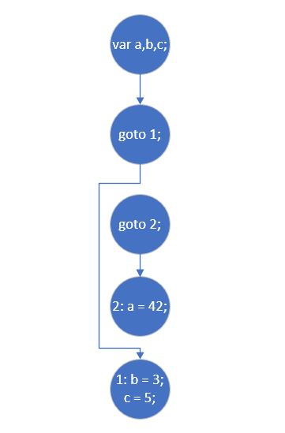

### Удаление нидостижимого кода

#### Постановка задачи
Необходимо было реализовать оптимизацию удалющую недостижимый код

#### Команда
К. Галицкий, А. Черкашин

#### Зависимые и предшествующие задачи
Предшествующие задачи:
* Трехадресный код
* Построение CFG. Обход потомков и обход предков для каждого ББл
* Алгоритм упорядочения в глубину с построением глубинного остовного дерева

#### Теоретическая часть
В рамках этой задачи необходимо было реализовать оптимизацию устранения недостижимого кода. Такой код чаще всего образуется в случаях написания программного кода с использованием операторов безусловного прехода. Например:
* До оптимизации
```csharp
var a, b, c;
goto 1;
goto 2;
2: a = 42;
1: b = 3;
c = 5;
```
* После оптимизации
```csharp
var a, b, c;
goto 1;
1: b = 3;
c = 5;
```

Пример графа с недостижимым кодом.



#### Практическая часть
Оптимальный способ применения: удаление недостижимого кода на этапе построение графа потока управления. Используя данные обхода графа в глубинну позволяет определить базовые блоки, которые являются недостижимыми. Суть метода заключается в проходе по всем ветка графа для каждого блока и поиск пути из начала графа в конец используя все допустимые комбинации блоков.
Реализовали удаление недостижимых блоков используя DFS:
```csharp
private List<BasicBlock> UnreachableCodeElimination()
{
	var tmpBasicBlock = new List<BasicBlock>(_basicBlocks);

	for (var i = 1; i < _dfn.Count - 1; i++)
	{
		if (_dfn[i] == 0)
		{
			tmpBasicBlock[i] = null;
		}
	}
	tmpBasicBlock.RemoveAll(x => x == null);
	return tmpBasicBlock.Skip(1).Take(tmpBasicBlock.Count - 2).ToList();
}
```

Удаление недостижимого кода происходит при каждом построении графа потока управления. После чего, граф перестраиваться с новым кодом, полученым после удаления недостижимых частей.
Для использования оптимизации, изменили функции вызова всех оптимизаций трехадресного кода так, что бы вызвать удаление недостижимого кода до оптимизации и после:
```csharp
public static List<Instruction> OptimizeAll(List<Instruction> instructions)
{
	var cfg = new ControlFlowGraph(instructions);
	cfg.ReBuildCFG(Optimize(cfg.GetInstructionsFromCFG(), BasicBlockOptimizations, AllCodeOptimizations));
	return cfg.GetInstructionsFromCFG();
}
```

#### Место в общем проекте (Интеграция)
Используется при создании графа потока управления и построения DFS по нему.
```csharp
    /* ... */
public ControlFlowGraph(List<BasicBlock> basicBlocks)
{
	ConstructedCFG(basicBlocks);
	DFS();
	ConstructedCFG(UnreachableCodeElimination());
	DFS();
}
    /* ... */
```

#### Тесты
В тестах проверяется, что применение оптимизации удаления недостижимого кода, возвращает ожидаемый результат:
```csharp
[Test]
public void EliminationdMultyBlocksTest1()
{
	var TAC = GenTAC(@"
var a, b, c;

goto 1;
111:a = 1; 
goto 55; 
55: goto 10; 
10: goto 111; 
if a>a goto 10; 
else goto 111; 

c = c; 
if a==b 
b = b; 

a = -1; 
b = -a; 
c = -(a+b); 
a = !b; 
c = !(a == b); 
1: b = 3;
");
	var cfg = new ControlFlowGraph(BasicBlockLeader.DivideLeaderToLeader(TAC));

	var actual = cfg.GetCurrentBasicBlocks().ToList();

	var expected = new List<BasicBlock>()
	{
		new BasicBlock(new List<Instruction>(){new Instruction("", "goto", "1", "", "")}),
		new BasicBlock(new List<Instruction>(){new Instruction("1", "assign", "3", "", "b")}),
	};


	AssertSet(expected, actual.Skip(1).Take(actual.Count - 2).ToList());

}
```
